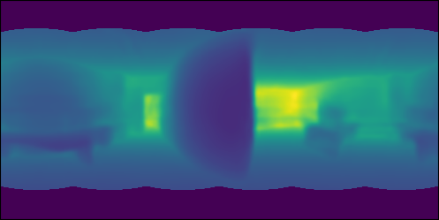

# FreDSNet
We are glad to present FreDSNet (**Fre**quential **D**epth and **S**emantics **Net**work). This is the first network which takes advantage of the Fast Fourier Convolutions for Scene Understanding purposes. Also, this is the first network that jointly obtains Semantic Segmentation and monocular Depth  from a single equirectangular panorama.
<p align="center">

</p>
<p align="center">


</p>

The presented code belongs to the investigation from the *on review* paper [FreDSNet: Joint Monocular Depth and Semantic Segmentation with Fast Fourier Convolutions](https://scholar.google.com/citations?user=LumAxQsAAAAJ&hl=es).

# Code
We provide our original implementation of **FreDSNet** and the code for obtaining the corresponding depth and semantic maps from equirectangular panoramas. We also provide a little code for 3D reconstruction of the environment taking as input the depth maps generated with our network.
To download the weigths used in the article, click [Here](https://drive.google.com/file/d/1m77CfwUGj6DlxRjheoO1sRxPdKewUbMK/view?usp=sharing)

First, we set up a virtual environment with [Anaconda](https://anaconda.org) and activate it as:
```bash
conda env create -f FreDSEnv.yaml

conda activate FreDS
```

An example of use of our network is:
```bash
python inference.py 
```
And, in case you do not have a GPU on your computer:
```bash
python inference.py --no_cuda
```

The input images are in *Example* and the output information will be stored in *Results*.

To generate the 3D reconstruction (no GPU is needed), run:
```bash
python room_viewer.py 
```
Obtaining these 3D reconstruction from the images from *Example*:

<p align="center">


</p>

# Note from the authors
This code has not been thoroughly tested, which means it may have some bugs. **Please use with caution.**

The authors and developers of this code want the best for the users and have gone to great lengths to make it easy to use and accessible. 
Be nice to them and enjoy their work.

If any problem may appear, do not hesitate and we will do our best to solve it (at least we will try).


# License
This software is under GNU General Public License Version 3 (GPLv3), please see GNU License

For commercial purposes, please contact the authors: Bruno Berenguel-Baeta (berenguel@unizar.es), Jesús Bermudez-Cameo (bermudez@unizar.es) and Josechu Guerrero (josechu.guerrero@unizar.es)
